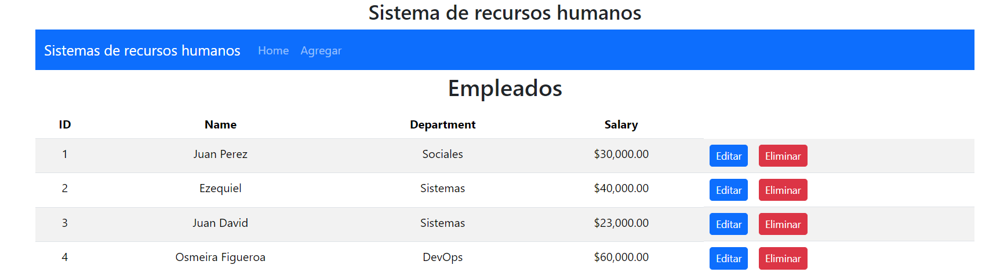

# README - Proyecto CRUD de Gestión de Usuarios

Este proyecto consiste en un CRUD (Create, Read, Update, Delete) para la gestión de usuarios. Está desarrollado utilizando React en el frontend y Spring Boot en el backend.

## Arquitectura

La arquitectura técnica utilizada en este proyecto sigue el patrón **MVC (Modelo-Vista-Controlador)** en el backend. Se organiza en tres capas principales:

1. **Modelos:** Contiene las clases que representan los objetos de datos utilizados en la aplicación.
2. **Repositorios:** Aquí se definen las interfaces que especifican las operaciones de acceso a datos para cada modelo.
3. **Servicios:** Contiene la lógica de negocio de la aplicación, que interactúa con los modelos y los repositorios para realizar operaciones CRUD.

En el frontend, la arquitectura sigue los principios de desarrollo de una aplicación React, donde los componentes están organizados de manera lógica para facilitar la modularidad y el mantenimiento.

## Tecnologías Utilizadas

- **Frontend:**
  - React
  - React Router (para la navegación)
  - React-Boostrap (para el diseño de la interfaz de usuario)

- **Backend:**
  - Spring Boot
  - Spring Data JPA (para el acceso a datos)
  - Spring Web (para la creación de servicios RESTful)
  - MySQL (o el sistema de gestión de bases de datos de tu elección)

## Configuración

Antes de ejecutar la aplicación, asegúrate de tener instalado Node.js, npm, y Maven en tu sistema.

1. Clona este repositorio en tu máquina local.
2. Para el backend, importa el proyecto como un proyecto Maven en tu IDE preferido.
3. Configura tu base de datos en el archivo `application.properties`.
4. Ejecuta el backend para iniciar el servidor.
5. Para el frontend, navega a la carpeta `frontend` en la línea de comandos.
6. Ejecuta `npm install` para instalar las dependencias.
7. Después de la instalación, ejecuta `npm start` para iniciar la aplicación React.

## Contribución

Si deseas contribuir a este proyecto, por favor sigue los siguientes pasos:

1. Haz un fork del repositorio.
2. Crea una nueva rama (`git checkout -b feature/nueva-caracteristica`).
3. Realiza tus cambios y haz commit de ellos (`git commit -am 'Agrega nueva característica'`).
4. Sube tus cambios a la rama (`git push origin feature/nueva-caracteristica`).
5. Crea un nuevo Pull Request.

¡Gracias por contribuir!

##Imagen

## Contacto

Si tienes alguna pregunta o sugerencia sobre este proyecto, no dudes en ponerte en contacto conmigo a través de [correo electrónico](jesusdavid4521@gmail.com)
